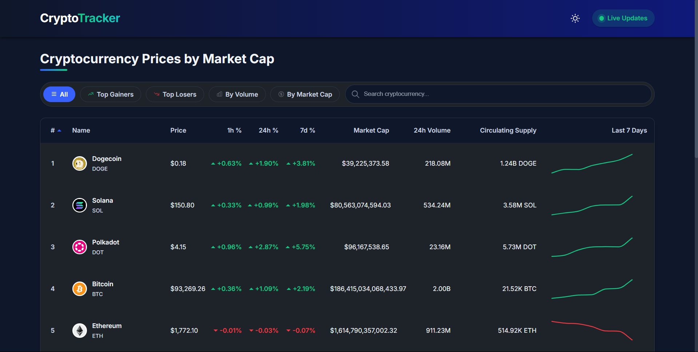

# Real-Time Crypto Price Tracker

A responsive React + Redux Toolkit application that tracks real-time cryptocurrency prices using Binance WebSocket API and manages all state via Redux.



## Demo Video

Check out the [demo video](https://drive.google.com/file/d/1EOgaN80iy91NhHcpHykcoDSBXrHV7q-I/view?usp=sharing) to see the application in action.

## Features

- **Real-time Data**: Displays top 10 cryptocurrencies with live price updates via Binance WebSocket API
- **Interactive UI**: Responsive table with key information and interactive elements
- **Dark/Light Mode**: Toggle between dark and light themes with smooth transitions
- **Advanced Filtering**:
  - Filter by top gainers and losers
  - Search by cryptocurrency name or symbol
  - Sort by any column (price, volume, market cap, etc.)
- **Visual Elements**:
  - Color-coded percentage changes
  - Mini-charts showing 7-day price trends
  - Custom hover effects for better UX
- **Navigation Helpers**:
  - Scroll-to-top button that appears when scrolling down
  - Smooth scrolling animations
- **Modern Footer**: Contact information, useful links, and social media icons
- **Persistence**: User preferences saved to localStorage (theme, filters, sort preferences)
- **Responsive Design**: Optimized for all screen sizes from mobile to desktop

## Technologies Used

- **React 19** with Hooks for UI components
- **TypeScript** for type safety
- **Redux Toolkit** for state management
- **WebSocket API** for real-time data streaming
- **Styled Components** for styling with theme support
- **Chart.js** and **react-chartjs-2** for interactive price charts
- **Context API** for theme management
- **LocalStorage** for persistent user preferences
- **Jest** for unit testing

## Getting Started

### Prerequisites

- Node.js (v14 or higher)
- npm or yarn

### Installation

1. Clone the repository
2. Install dependencies:
   ```
   npm install
   ```
3. Start the development server:
   ```
   npm start
   ```
4. Open your browser and visit: `http://localhost:3000`

### Running Tests

Run the test suite with:

```
npm test
```

## Project Structure

- `/src/app` - Redux store configuration
- `/src/components` - React components
- `/src/contexts` - Context providers (ThemeContext)
- `/src/features` - Redux slices and tests
- `/src/services` - WebSocket service
- `/src/utils` - Utility functions

## Implementation Details

### Theme System

The application implements a complete theming system:

- Theme toggle with sun/moon icons
- Theme preference stored in localStorage
- Automatic detection of system preference
- CSS variables for consistent styling
- Smooth transitions between themes

### State Management Architecture

- **Dual-state approach**: Original data and filtered view data
- **Redux store**: Central state management
- **Context API**: Theme management
- **WebSocket integration**: Real-time updates to Redux state

### WebSocket Integration

- Real-time connection to Binance's market ticker stream
- Automatic reconnection with exponential backoff
- Error handling and status reporting

### UI Components

- **Header**: App logo, theme toggle, and connection status
- **Filter Bar**: Category filters and search functionality
- **Crypto Table**: Dynamic, sortable data presentation
- **Mini Charts**: Interactive price trend visualization
- **Footer**: Contact info, navigation links, social icons
- **Scroll-to-Top**: Dynamic button for improved navigation

## Future Enhancements

- Portfolio tracking functionality
- Price alerts and notifications
- Additional technical indicators
- Historical data comparison
- News integration from crypto-related sources

## License

MIT

## Contributors

- Lokanath Panda - Developer and Designer

## Acknowledgments

- Binance API for real-time cryptocurrency data
- The React and Redux teams for their excellent libraries
